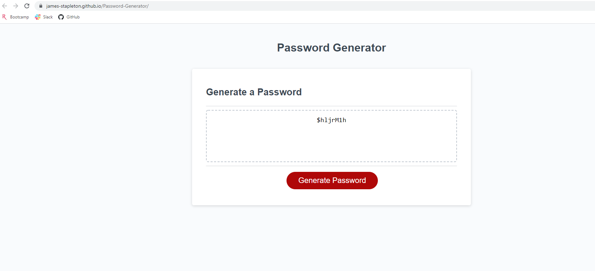

# Password Generator Starter Code

## Description

This is a web application to generate a random password. It creates several optional arrays of characters that the user may select to include in their password (lower and uppercase letters, numeric and special characters). In addition, it provides functionality for the user to select the length of the password. The arrays for each of these character sets is associated by index with an array of booleans to determine whether or not the user would like to include that set in the bank of random characters. This data is validated to ensure that at least one character set is chosen and that the length is between 8 and 128 characters. An array of the character arrays and an empty array are used to concatenate the users' selections into one large character bank, which is then pulled from by a randomly generated index to fill the password string. 

## Link 

https://james-stapleton.github.io/Password-Generator/

## Screenshot

